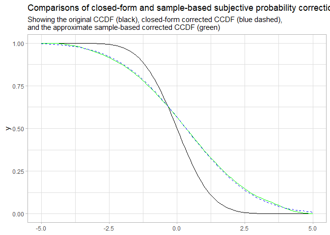

Empirical Subjective Probability Correction
================
Matthew Kay
2022-12-08

``` r
library(ggplot2)
```

This document demonstrates application of the subjective probability
correction to a distribution without using its parametric form (i.e.,
just using a large sample from that distribution, as is often available
from MCMC methods).

First, generate some Normally-distributed data:

``` r
set.seed(1234)
x = rnorm(10000)
```

Then, define the LPR and inverse-LPR functions we’ll use for the
correction:

``` r
probit = qnorm
inv_probit = pnorm
alpha = -0.33
beta = 2
lpr = function(p) inv_probit(alpha + beta * probit(p))
inv_lpr = function(p) inv_probit((probit(p) - alpha) / beta)
```

Now, determine the CCDF and the corrected CCDF. Note this is done
without knowing the parametric form of the distribution, we are just
using a kernel density estimator (the `density()` function) to derive an
approximation of the CDF. We do this instead of using the ECDF —
`ecdf()` — because `ecdf()` goes to zero too quickly in the tails to be
able to apply the correction:

``` r
# we use cut and adjust to increase the bandwidth and ensure density further
# into the tails of the distribution so that we can apply the correction
# outside the range of the samples
f_x = density(x, cut = 10, adjust = 2)
cdf = approxfun(f_x$x, cumsum(f_x$y) / sum(f_x$y))

ccdf = function(x) 1 - cdf(x)
inv_lpr_ccdf = function(x) inv_lpr(ccdf(x))
```

Now we compare the original distribution (black), the
empirically-corrected distribution (red; done without knowing the
parametric form) and the closed-form corrected distribution (blue
dashed; done using the correction derived in the paper):

``` r
ggplot() +
  stat_function(fun = ccdf, color = "black") +
  stat_function(fun = inv_lpr_ccdf, color = "green") +
  stat_function(fun = \(x) 1 - pnorm(x, -alpha, beta), color = "blue", linetype = "dashed") +
  xlim(-5, 5) +
  theme_light() +
  labs(
    title = "Comparisons of closed-form and sample-based subjective probability correction",
    subtitle = "Showing the original CCDF (black), closed-form corrected CCDF (blue dashed),\nand the approximate sample-based corrected CCDF (green)"
  )
```

<!-- -->

Note some minor issues in the tail, but overall the approximate
correction without knowing the parametric form of the distribution
matches the closed-form solution well. For bounded distributions (e.g. a
Beta distribution), this would be even easier, as a bounded density
estimator could be used, ensuring non-zero probability over the full
support of the distribution, which will avoid tail issues.
