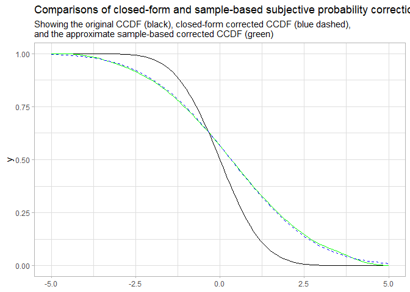
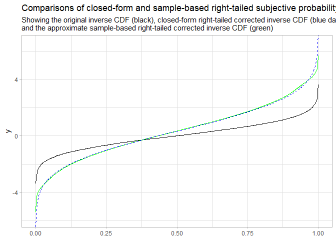
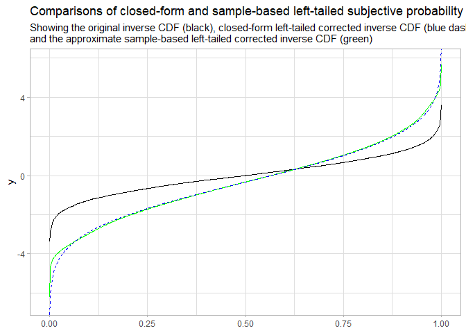

Empirical Subjective Probability Correction
================
Matthew Kay
2022-12-08

``` r
library(ggplot2)
```

This document demonstrates application of the subjective probability
correction to a distribution without using its parametric form (i.e.,
just using a large sample from that distribution, as is often available
from MCMC methods).

First, generate some Normally-distributed data:

``` r
set.seed(1234)
x = rnorm(10000)
```

Then, define the LPR and inverse-LPR functions we’ll use for the
correction:

``` r
probit = qnorm
inv_probit = pnorm
alpha = -0.33
beta = 2
lpr = function(p) inv_probit(alpha + beta * probit(p))
inv_lpr = function(p) inv_probit((probit(p) - alpha) / beta)
```

Now, determine the CCDF and the corrected CCDF. Note this is done
without knowing the parametric form of the distribution, we are just
using a kernel density estimator (the `density()` function) to derive an
approximation of the CDF. We do this instead of using the ECDF —
`ecdf()` — because `ecdf()` goes to zero too quickly in the tails to be
able to apply the correction:

``` r
# we use a large value for cut (10, not the default 3) and adjust to increase 
# the bandwidth and ensure density further into the tails of the distribution 
# so that we can apply the correction outside the range of the samples
f_x = density(x, cut = 10, adjust = 2)
x_grid = f_x$x
F_x_grid = cumsum(f_x$y) / sum(f_x$y)   # values of the CDF at x_grid
cdf = approxfun(x_grid, F_x_grid)

ccdf = function(x) 1 - cdf(x)
inv_lpr_ccdf = function(x) inv_lpr(ccdf(x))
```

To get the quantile function, we need to either construct it for the
left-tailed or right-tailed correction. For the left-tailed correction
CDF, we apply the adjustment to the CDF, then back out weights
corresponding to each x and use them to create the quantile function:

``` r
corrected_F_x_left = inv_lpr(F_x_grid)   # values of the left-tailed corrected CDF at x_grid
corrected_f_x_left = diff(c(0, corrected_F_x_left))  # weight at x_grid in left-tailed dist
corrected_inv_cdf_left = ggdist::weighted_quantile_fun(x_grid, weights = corrected_f_x_left)
```

Similarly, if we want the inverse of the corrected CDF for the
right-tailed correction, we apply the correction to the CCDF and then
turn it back into a CDF (with `1 -`):

``` r
corrected_F_x_right = 1 - inv_lpr(1 - F_x_grid)   # values of the right-tailed corrected CDF at x_grid
corrected_f_x_right = diff(c(0, corrected_F_x_right))  # weight at x_grid in right-tailed dist
corrected_inv_cdf_right = ggdist::weighted_quantile_fun(x_grid, weights = corrected_f_x_right)
```

Now we compare the original distribution (black), the
empirically-corrected distribution (red; done without knowing the
parametric form) and the closed-form corrected distribution (blue
dashed; done using the correction derived in the paper):

``` r
ggplot() +
  stat_function(fun = ccdf, color = "black") +
  stat_function(fun = inv_lpr_ccdf, color = "green") +
  stat_function(fun = \(x) 1 - pnorm(x, -alpha, beta), color = "blue", linetype = "dashed") +
  xlim(-5, 5) +
  theme_light() +
  labs(
    title = "Comparisons of closed-form and sample-based subjective probability correction",
    subtitle = "Showing the original CCDF (black), closed-form corrected CCDF (blue dashed),\nand the approximate sample-based corrected CCDF (green)"
  )
```

<!-- -->

Note some minor issues in the tail, but overall the approximate
correction without knowing the parametric form of the distribution
matches the closed-form solution well. For bounded distributions (e.g. a
Beta distribution), this would be even easier, as a bounded density
estimator could be used, ensuring non-zero probability over the full
support of the distribution, which will avoid tail issues.

We can also compare the empirically-corrected right-tailed inverse CDF
to the closed form inverse CDF:

``` r
ggplot() +
  stat_function(fun = ggdist::weighted_quantile_fun(x), color = "black", n = 1001) +
  stat_function(fun = corrected_inv_cdf_right, color = "green", n = 1001) +
  stat_function(fun = \(x) qnorm(x, -alpha, beta), color = "blue", linetype = "dashed", n = 1001) +
  xlim(0, 1) +
  theme_light() +
  labs(
    title = "Comparisons of closed-form and sample-based right-tailed subjective probability correction",
    subtitle = "Showing the original inverse CDF (black), closed-form right-tailed corrected inverse CDF (blue dashed),\nand the approximate sample-based right-tailed corrected inverse CDF (green)"
  )
```

<!-- -->

We can also compare the empirically-corrected left-tailed inverse CDF to
the closed-form inverse CDF:

``` r
ggplot() +
  stat_function(fun = ggdist::weighted_quantile_fun(x), color = "black", n = 1001) +
  stat_function(fun = corrected_inv_cdf_left, color = "green", n = 1001) +
  stat_function(fun = \(x) qnorm(x, alpha, beta), color = "blue", linetype = "dashed", n = 1001) +
  xlim(0, 1) +
  theme_light() +
  labs(
    title = "Comparisons of closed-form and sample-based left-tailed subjective probability correction",
    subtitle = "Showing the original inverse CDF (black), closed-form left-tailed corrected inverse CDF (blue dashed),\nand the approximate sample-based left-tailed corrected inverse CDF (green)"
  )
```

<!-- -->
